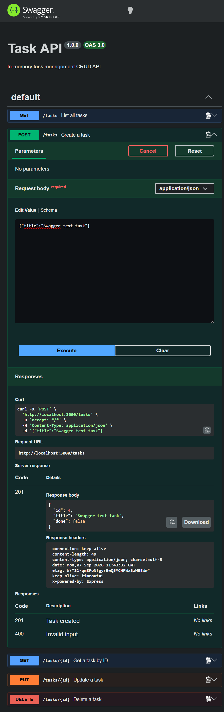

# In-Memory Task CRUD API

A lightweight RESTful CRUD API built with Node.js and Express that manages tasks in-memory.

## How to Run

```bash
npm install
npm start
```

Server runs locally at `http://localhost:3000`.

Swagger UI is live at `http://localhost:3000/docs`.

## Endpoints

| Method | Endpoint | Description | Success Code | Error Codes |
| --- | --- | --- | --- | --- |
| GET | `/` | API info and metadata | 200 | - |
| GET | `/health` | Server health check | 200 | - |
| GET | `/tasks` | List all tasks | 200 | - |
| GET | `/tasks/:id` | Retrieve single task | 200 | 404 |
| POST | `/tasks` | Create a new task | 201 | 400 |
| PUT | `/tasks/:id` | Update existing task | 200 | 400, 404 |
| DELETE | `/tasks/:id` | Remove task | 204 | 404 |

## Sample curl Output

```text
$ curl -i -X POST http://localhost:3000/tasks -H "Content-Type: application/json" -d '{"title":"Test task"}'

HTTP/1.1 201 Created
Content-Type: application/json; charset=utf-8
Content-Length: 38
Date: Mon, 07 Sep 2026 10:54:16 GMT
Connection: keep-alive

{"id":4,"title":"Test task","done":false}
```

## Swagger UI Documentation



## Push to GitHub

```bash
git remote add origin https://github.com/<your-username>/<your-repo-name>.git
git branch -M main
git push -u origin main
```